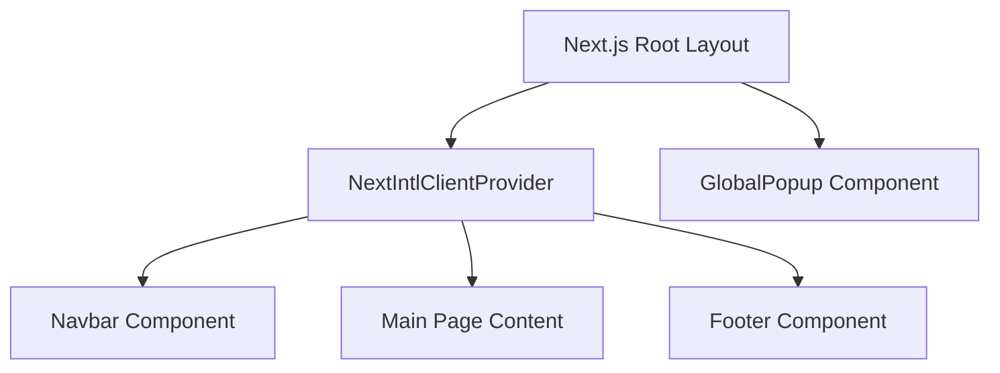

# Logisti-K Frontend Architecture & Mobile Navigation Reference

This document serves as the official frontend implementation, styling, and architectural guide for the **Logisti-K** platform. It provides developers with the design specifications, responsive guidelines, and code conventions required to maintain design consistency and mobile-first compliance across all existing and future pages, admin dashboards, and reusable **FOES (Freight Operations & Enterprise System)** modules.

---

## 1. Project Overview

Logisti-K is built as a modern, high-performance web application utilizing **Next.js 16** and **React 19**. It features a robust multi-language system, dynamic data integrations via **Supabase**, and smooth, hardware-accelerated animations powered by **Framer Motion**.

### Core Technology Stack
- **Framework**: Next.js (v16.2.4) using the App Router architecture.
- **Library**: React (v19.2.4) with React Server Components (RSC) and Server Actions.
- **Styling**: Tailwind CSS (v4.x) utilizing CSS-in-theme declarations.
- **Database / Backend**: Supabase (using `@supabase/ssr` v0.10.3 and `@supabase/supabase-js` v2.106.0).
- **Localization**: `next-intl` (v4.11.0) providing static and dynamic bilingual routes.
- **Animations**: `framer-motion` (v12.38.0) and CSS keyframe animations.
- **Iconography**: `lucide-react` (v1.14.0) and `react-icons` (v5.6.0).

---

## 2. Folder Architecture

The frontend directory is organized to separate server-side business logic, client-side UI interactive components, global styles, translations, and database helpers.

```
frontend/
├── messages/                       # JSON translation files
│   ├── en.json                     # English translations
│   └── es.json                     # Spanish translations
├── public/                         # Static assets (images, icons)
│   ├── images/                     # Certifications & background illustrations
│   └── logo_logistik.png           # Company branding logo
├── src/
│   ├── actions/                    # Next.js Server Actions (Supabase mutations)
│   │   ├── popups.ts               # Active popup CRUD operations
│   │   └── reviews.ts              # Client review submit/approve operations
│   ├── app/                        # App Router directory
│   │   ├── globals.css             # Tailwind v4 globals, variables, theme overrides
│   │   └── [locale]/               # Localized route wrapper
│   │       ├── about/              # About page
│   │       ├── admin/              # Admin dashboard panel
│   │       ├── contact/            # Contact form page
│   │       ├── review/             # Shareable review submissions
│   │       ├── services/           # Services list page
│   │       ├── track/              # Shipment tracking page
│   │       ├── layout.tsx          # Multi-locale layout wrapper
│   │       └── page.tsx            # Main landing page
│   ├── components/                 # Reusable React components
│   │   ├── LanguageSwitcher.tsx    # Language switch control
│   │   ├── layout/                 # Layout components (Navbar, Footer, Popups)
│   │   └── sections/               # Landings pages sections
│   ├── hooks/                      # Custom React hooks
│   ├── i18n/                       # Internationalization routers
│   │   ├── request.ts              # next-intl server configuration
│   │   └── routing.ts              # next-intl router creation
│   └── utils/                      # Utilities
│       └── supabase/               # Supabase SSR client initialization
│           ├── client.ts           # Browser-side client setup
│           └── server.ts           # Server-side client setup
└── supabase_schema.sql             # SQL database schema definitions
```

---

## 3. Routing Architecture

Routing is managed dynamically through a localized sub-routing architecture (`[locale]`) configured in [routing.ts](file:///Users/oscarmg/Desktop/cargoflow-platform/frontend/src/i18n/routing.ts).

### Locale-Based Route Segments
The default locale is set to **English (`en`)**, with full support for **Spanish (`es`)**. All routes must fall under the `[locale]` parameter:
- `/en` or `/es`: Homepage (Page segment loader)
- `/en/about` or `/es/about`: Company Mission, Vision, and Values
- `/en/services` or `/es/services`: Logistics Solutions portfolio
- `/en/track` or `/es/track`: Search inputs for logistics statuses
- `/en/contact` or `/es/contact`: Interactive inquiry forms
- `/en/review` or `/es/review`: Direct link for submitting ratings
- `/en/admin` or `/es/admin`: Private reviews approval and pop-up editor

### Internationalized Navigation Helpers
Developers must import routing elements directly from `@/i18n/routing` instead of `next/link` or `next/navigation` to preserve the active locale across route transitions:
```tsx
import { Link, useRouter, usePathname } from '@/i18n/routing';
```

---

## 4. Layout Hierarchy

The application shell is nested inside [layout.tsx](file:///Users/oscarmg/Desktop/cargoflow-platform/frontend/src/app/[locale]/layout.tsx). 



### Key Execution Highlights:
1. **Locale Validation**: The layout parses the `locale` parameter and checks it against routing configurations. If invalid, it executes `notFound()`.
2. **Translation Loading**: Messages are resolved asynchronously on the server (`getMessages()`) and passed down via `NextIntlClientProvider` to enable client-side translations.
3. **Scroll & Overflow Containment**: The body tag enforces a strict bounds policy to prevent unwanted viewport expansions:
   ```html
   <body class="min-h-full flex flex-col bg-white text-[#07142b] font-sans w-full max-w-full overflow-x-hidden">
   ```
4. **Popup Layer Isolation**: The `GlobalPopup` component is placed outside the translation provider container or directly within the base layout shell to allow overlay control on top of all headers.

---

## 5. Component Hierarchy

Landing pages are assembled dynamically using focused, modular sections. The index page [page.tsx](file:///Users/oscarmg/Desktop/cargoflow-platform/frontend/src/app/[locale]/page.tsx) handles the top-to-bottom assembly of sections:

```
HomePage (App Segment)
 ├── Hero.tsx
 ├── ClientReviews.tsx
 ├── AboutUs.tsx
 ├── MissionVision.tsx
 ├── Services.tsx
 ├── TrackingPreview.tsx
 ├── CustomerPortal.tsx
 ├── Cta.tsx
 └── WhatsApp Floating Button
```

### Component Categories
- **Global Layout Elements**: Elements persistent across all pages (`Navbar`, `Footer`, `GlobalPopup`).
- **Marketing Landing Sections**: Self-contained structural folds rendering specific content bundles (`Hero`, `Services`, `AboutUs`).
- **Interactive Action Pages**: Views executing state mutations or backend queries (`AdminPage` dashboard, `/contact` email forms, `/review` submissions).

---

## 6. Responsive System

The design system implements a strict **mobile-first** responsive approach, scaling layouts smoothly using Tailwind’s viewport breakpoints.

### Breakpoint Matrix

| Screen Size | Breakpoint | Pixel Width | Typical Target |
| :--- | :--- | :--- | :--- |
| Mobile (Portrait) | - | `< 640px` | Smart phones (vertical layout) |
| Mobile (Landscape) | `sm` | `>= 640px` | Large phones, small tablets |
| Tablet (Portrait) | `md` | `>= 768px` | iPads, standard tablets |
| Laptop / Small Monitor | `lg` | `>= 1024px` | Laptops, small desktop screens |
| Desktop Monitor | `xl` | `>= 1280px` | Standard desktop screens |
| Ultra-Wide Monitor | `2xl` | `>= 1536px` | Large workspace monitors |

### Standard Container Patterns
To maintain consistency across devices, layouts use centered containers limited by screen-width thresholds:
- **Maximum Width Wrapper**: `w-full max-w-7xl mx-auto px-4 sm:px-6 lg:px-8`
- **Section Spacing**: Vertically padded with `py-12 md:py-20 lg:py-24` to maintain standard visual separation.
- **Flex-to-Grid Transitions**: Items scale from single columns on mobile to multi-column grids on desktop:
  ```html
  <div class="grid grid-cols-1 md:grid-cols-2 lg:grid-cols-3 gap-8">
  ```

---

## 7. Mobile Navbar Architecture & Responsive Logic

The mobile navbar is a critical UI element that requires detailed layout rules to prevent common bugs such as translation overlaps, viewport clipping, and overlay rendering issues.

### Desktop vs. Mobile Layout Render Rules

```
+-----------------------------------------------------------------------------------+
| [Logo]            Home   Services   About   Tracking   Contact  [EN/ES] [Sign In] |  Desktop (md/lg+)
+-----------------------------------------------------------------------------------+

+-----------------------------------------------------------------------------------+
| [Logo]                                       [EN/ES] [Iniciar Sesión] [=] (Menu)  |  Mobile (< md)
+-----------------------------------------------------------------------------------+
```

#### Breakpoint Breakdown
- **Desktop (md and larger)**: The main `<nav>` menu list is visible (`hidden md:flex`). Inactive items transition to active hover orange (`#F05A28`) with an under-line indicator.
- **Mobile (smaller than md)**: The main menu list is hidden. An inline CTA (`signInSignUpMobile`) renders compactly as a small button, accompanied by a hamburger toggle icon (`Menu`/`X` from Lucide).

### Navbar Dropdown Architecture

```html
<!-- Fixed Outer Wrapper -->
<div class="relative z-[9999]">
  <header class="fixed top-4 md:top-6 left-0 right-0 z-[9999] px-2 md:px-4">
    <!-- Centered Header Box -->
    <div class="mx-auto flex h-[60px] md:h-[70px] lg:h-[80px] bg-white/95 backdrop-blur-md rounded-full border border-gray-200 shadow-sm px-4 md:px-6 items-center justify-between">
      ...
    </div>
    
    <!-- Absolute Mobile Dropdown Menu -->
    <div class="md:hidden absolute left-4 right-4 top-full mt-2 z-[9999] rounded-2xl border border-slate-200 bg-white p-4 shadow-2xl overflow-visible">
      ...
    </div>
  </header>
</div>
```

### Analysis of Common Mobile Dropdown Bugs

Previous implementations suffered from dropdown menu items getting clipped or hidden when scrolls were triggered. This occurred due to the following styling mistakes:
1. **Overflow Clipping**: Adding `overflow-hidden` on parent container elements (such as `header` or the page's `<main>` container) prevents absolute-positioned elements from displaying outside their bounding box.
2. **Absolute Positioning Reference Errors**: Positioning absolute menus relative to the inner logo/button bar rather than using the full viewport screen limits (`left-4 right-4 top-full`) causes menus to shrink and align incorrectly.
3. **Z-Index Cascading Failure**: Renders showing tracking widgets, carousels, or forms with high z-indexes (like `z-10` or `z-20` on relative items) will clip headers. The header container must explicitly be set to the highest stacking context (`z-[9999]`).

### Best Practices to Prevent Clipping
- Enforce `overflow-visible` on the main `<header>` container at all times.
- Ensure the dropdown overlay positioning targets `top-full` with a standard top margin (`mt-2`) to avoid gaps.
- Use explicit viewport borders (`left-4 right-4`) to support both landscape and portrait dimensions.

---

## 8. Tailwind CSS Strategy (v4)

Logisti-K utilizes **Tailwind CSS v4**. In this version, configuration is handled entirely within the CSS entry point via `@theme` declarations, removing the need for a separate `tailwind.config.js`.

### Custom Color System (`globals.css`)
Custom color variables are defined directly inside the theme block and can be accessed dynamically using standard tailwind prefixes:

```css
@theme {
  --color-primary: #E63946;         /* Bright Red Accent */
  --color-primary-dark: #D62828;    /* Dark Red */
  --color-accent: #F77F00;          /* Vibrant Orange */
  --color-accent-light: #FCBF49;    /* Gold Highlight */
  --color-navy: #07142b;            /* Primary Text Dark */
  --color-neutral-dark: #121212;    /* Dark mode background */
  --color-neutral-light: #F8F9FA;   /* Page light background */
  --color-neutral-gray: #6C757D;    /* Subtitles and captions */
}
```

### Typographical Styles
Font configurations default to a system sans-serif font stack (`font-sans`), with text sizing ranging from `text-xs` (nav utilities) to `text-[3.5rem]` (Hero headings). Text balance utility (`text-balance`) is declared within `@layer utilities` to prevent awkward word wrapping on titles.

### Built-in Marquee Animation
An infinite horizontal scroll animation is configured globally for trusted brand logos:
```css
@keyframes marquee {
  0% { transform: translateX(0); }
  100% { transform: translateX(-50%); }
}

.animate-marquee {
  animation: marquee 30s linear infinite;
}
```

---

## 9. Translation Architecture

Translations are fully managed via `next-intl` namespaces. This ensures clean key-value structures, easy addition of new languages, and static site generation support.

### Translation File Structure (`/messages/`)
Translation keys are divided into namespace objects representing pages or components:
- **`Navigation`**: Site menu labels and auth hooks.
- **`Hero`**: Page headings, subtitles, and primary buttons.
- **`AboutUs` / `about`**: Paragraph descriptions, certifications, and core pillars.
- **`Services`**: Breakdown of services (cargo transport, warehousing, air/ocean freight).
- **`Contact`**: Form labels, dropdown inputs, and submission states.
- **`ClientReviews`**: User reviews forms, stars selection, and statuses.

### Dynamic switcher implementation (`LanguageSwitcher.tsx`)
The switcher operates by reading the active locale via `useLocale()`, modifying the URL parameter with `router.replace(pathname, { locale: nextLocale })`, and executing the route modification inside React's `useTransition` hook. This ensures state transitions remain responsive and smooth.

---

## 10. UI/UX Reusable Systems

To keep the platform modular and support future **FOES** developments, the interface relies on specific reusable design patterns.

### 1. Hero Folds
- **Structure**: High-contrast, full-screen background image (`object-cover`) with a dark overlay gradient (`from-black/75 via-black/45 to-black/15`) to keep text highly legible.
- **Buttons**: A dual-action CTA stack containing a primary gradient action (`from-[#F05A28] to-[#E63946]`) and a secondary dark outline action.

### 2. Standard Card Pattern
- **Light Theme**: White background, subtle border (`border-gray-50` or `border-neutral-200`), rounded boundaries (`rounded-2xl`), shadow offsets (`shadow-xl`), and hover scaling (`hover:-translate-y-1 transition-transform duration-300`).
- **Dark Theme**: Dark navy fill (`bg-navy` or `bg-slate-900`) combined with white borders and high-opacity descriptive text.

### 3. Stat Blocks
- **Layout**: Large, bold numbers (e.g. `10+`, `100%`) styled in primary orange/red colors, stacked above a small, uppercase description label.

### 4. Interactive Forms
- **Fields**: Large, rounded-lg (`rounded-lg`) inputs with a clean gray background (`bg-neutral-50`). Highlight borders transition to brand orange on focus (`focus:border-[#F05A28] focus:ring-1 focus:ring-[#F05A28]`).

### 5. Floating Widgets
- **WhatsApp Button**: Fixed placement (`fixed bottom-6 right-6 z-50`) with an explicit size. Hover animations (`hover:scale-110 transition-transform`) trigger micro-interactions.

---

## 11. Supabase Integration & Data Flow

Logisti-K integrates with Supabase to provide real-time updates for client reviews and website marketing pop-ups.

### Database Schema Overview (`supabase_schema.sql`)
1. **`reviews` Table**:
   - `id` (UUID, primary key)
   - `quote` (text)
   - `author` (text)
   - `role` (text)
   - `company` (text)
   - `rating` (integer, checked 1-5)
   - `status` (text, checked 'pending', 'approved', 'rejected')
   - `created_at` (timestamptz)
2. **`popups` Table**:
   - `id` (UUID, primary key)
   - `title` (text)
   - `content` (text)
   - `image_url` (text, optional)
   - `cta_text` (text, optional)
   - `cta_link` (text, optional)
   - `is_active` (boolean)
   - `created_at` (timestamptz)

### Row-Level Security (RLS) Configuration
To protect user data while allowing public submissions, RLS policies are configured as follows:
- **Reviews Public Policy**: Anyone can insert a review (`status` defaults to `'pending'`), but reading reviews is strictly restricted to approved items (`status = 'approved'`).
- **Popups Public Policy**: Users can only read popups that are active (`is_active = true`).
- **Admin Dashboard**: Requires elevated credentials (configured on the Supabase dashboard) to allow full CRUD operations (approve/reject/delete).

### Server Actions Architecture
Data fetching and mutations are handled using Next.js Server Actions:
- **`getApprovedReviews`**: Fetches approved reviews to display on the landing page.
- **`submitReview`**: Inserts a new review into the database.
- **`getAllReviews` / `updateReviewStatus`**: Enables the admin dashboard to manage entries.
- **`getActivePopup`**: Checks for active popups to display when users load the page.

---

## 12. Future Scalability & FOES Compatibility

To transition the Logisti-K frontend into a unified dashboard shell or adapt it for other freight forwarding partners under the **FOES** reusable ecosystem, the following recommendations should be implemented:

### 1. Abstract Design Tokens
Move color specifications from inline utilities to CSS class sets. This allows the application to support multi-tenancy skinning by simply changing a theme class on the body tag:
```html
<body class="theme-foes text-navy bg-white">
```

### 2. Component Extraction
Extract core elements like buttons, inputs, modals, and tables into a shared UI folder (`/components/ui/`). Future pages can import standard UI blocks instead of defining ad-hoc styling layers:
```tsx
import { Button } from '@/components/ui/Button';
import { Card } from '@/components/ui/Card';
```

### 3. Server Actions & Middleware Authentication
Secure the `/admin` dashboard route using Next.js middleware rather than client-side React hooks. This prevents unauthorized rendering of administrative panels and checks cookies directly on the server edge.

### 4. Build a Shared Business Logic SDK
Separate API calls and Supabase models from component files. Maintain a dedicated services layer (`/services/`) that can be shared across multiple platforms (e.g. tracking systems, cargo booking, and customer portals).

---

## 13. Responsive QA & Verification Guidelines

To guarantee maximum accessibility, seamless layout presentation, and rock-solid usability across all customer interfaces, all frontend features must comply with the following strict responsive validation protocol.

### Mandatory Viewport Testing Grid

Every new interface, dashboard view, or component change MUST be tested and verified under the following environments:

1. **Standard Mobile Portrait Mode** (Viewport Width: `320px` to `480px`): Verifies column collapse rules, text wrapping, and tap-target sizes.
2. **Mobile Landscape Mode** (Viewport Width: `480px` to `768px`): Ensures scrolling behaviors, height-restricted hero cards, and modal viewport limits are respected.
3. **Mobile Browser with Desktop Site Disabled** (Default Mobile User-Agent): Standard layout rendering validation.
4. **Mobile Browser with Desktop Site Enabled** (Desktop User-Agent on Mobile Screen): Verifies viewport scaling and zoom constraints.
5. **Intermediate Viewport Widths** (Viewport Width: `768px` to `1024px`): Tests boundaries between standard mobile layouts and large laptop containers (tablet transition stages).
6. **Android Chrome Testing**: Cross-browser layout verification on Android system engines.
7. **iOS Safari Testing**: Cross-browser layout verification on Apple webkit rendering engines.

### Non-Negotiable Navbar Constraints

During QA evaluations, the application's header and navigation system must strictly satisfy these rules:

* **No Disappearance / Ghosting**: The navbar must remain visible or toggle states correctly without vanishing into background layers during scroll movements.
* **No Dropdown Clipping**: Dropdown navigation drawers and custom popups must hover cleanly over section layers and must never be cut off by `overflow-hidden` configurations on layout wrappers.
* **No Horizontal Overflow**: The header element and all child links/buttons must wrap or resize cleanly, guaranteeing that no horizontal scrollbars are spawned.
* **No Hidden Mobile Actions**: Essential user actions (such as language selector switchers and Sign In/Sign Up links) must remain fully accessible on small viewports without overlapping.
* **No Broken Hamburger Interactions**: Menu button state clicks must toggle visibility transitions immediately, trap focus where appropriate, and block page interactions while expanded.

